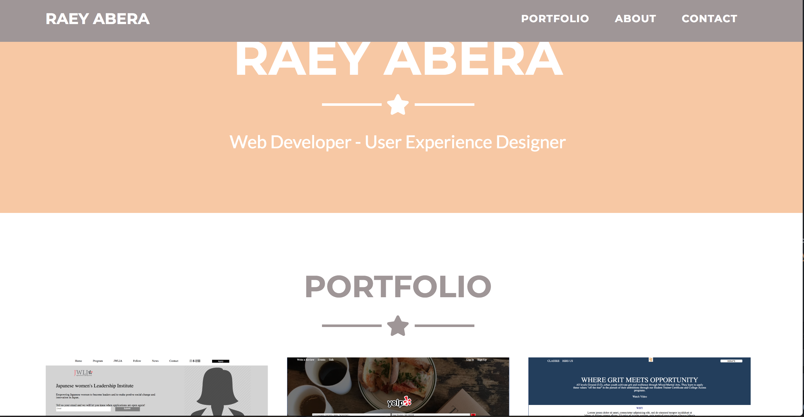

# PORTFOLIO SITE PROJECT
I built my portfolio site using bootstrap and scss in order to meet a quick turn around. It was equally fun and frustrating working through and making changes to this code.

## How It's Made:
Used html, css, scss, bootstrap and a compiler to display content and style a clean website. Used javascript to make it functional.

**Tech used:** HTML, CSS +SCSS, bootstrap, javascript

## Optimizations
I would build my own site from the ground up. 

## Lessons Learned:
I learned how to navigate another person's code and how scss works with css. I learned that templates don't leave much room for design options outside of the template design without compromising time.
# portfolio-site
